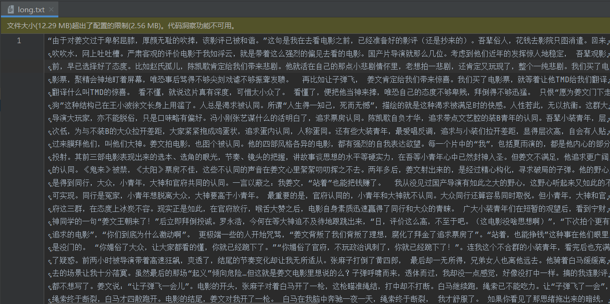

# 豆瓣影评爬取及分析
- 本项目通过输入豆瓣电影id， 爬取电影所有长评用作词云展示和200条短评用作情感分析

​	问：为什么不通过电影名爬取？

​	豆瓣搜索防爬严重，数据放在js文件中层层加密，网上破解方法较为老旧，且该项目时间紧张，没时间折腾，有兴趣者自行尝试

- 词云通过jieba分词和wordcloud生成词云图像

- 情感分析通过利用cemotion生成情感分数 详情：https://github.com/Cyberbolt/Cemotion/tree/master/Cemotion/cemotion

1. 获取电影id
   例如： https://movie.douban.com/subject/34841067/ 其中 34841067 为 id

   

2. 导入包

```
//评论爬取
requests==2.25.1
bs4==0.0.1
//词云
wordcloud==1.8.1
jieba==0.42.1
imageio==2.9.0
//情感分析
cemotion==0.3.3

//解决cemotion和matplotlib对numpy版本要求差异问题
numpy==1.19.5
```

**友情提示：**`cemotion`包需要下在数据集`rnn_emotion_x86_1.0_2.h5`（200M）由于作者提供地址下载较慢

，故提供一个百度地址：链接：https://pan.baidu.com/s/1qsM99cXrmx-AsCC6Szgeig 提取码：oph1 
复制这段内容后打开百度网盘手机App，操作更方便哦

下载完成后放在：`venv\Lib\site-packages\cemotion\models`目录下即可


3. 运行 `main.py`


- 等待爬取完成和分析 ，爬取内容保存为txt文本，可自定义文件名。

- 词云和情感分析读取指定文件内容并分析和展示。

4. 结果展示

   + 爬取内容：

   

   

   + 词云

   

   + 情感

   

